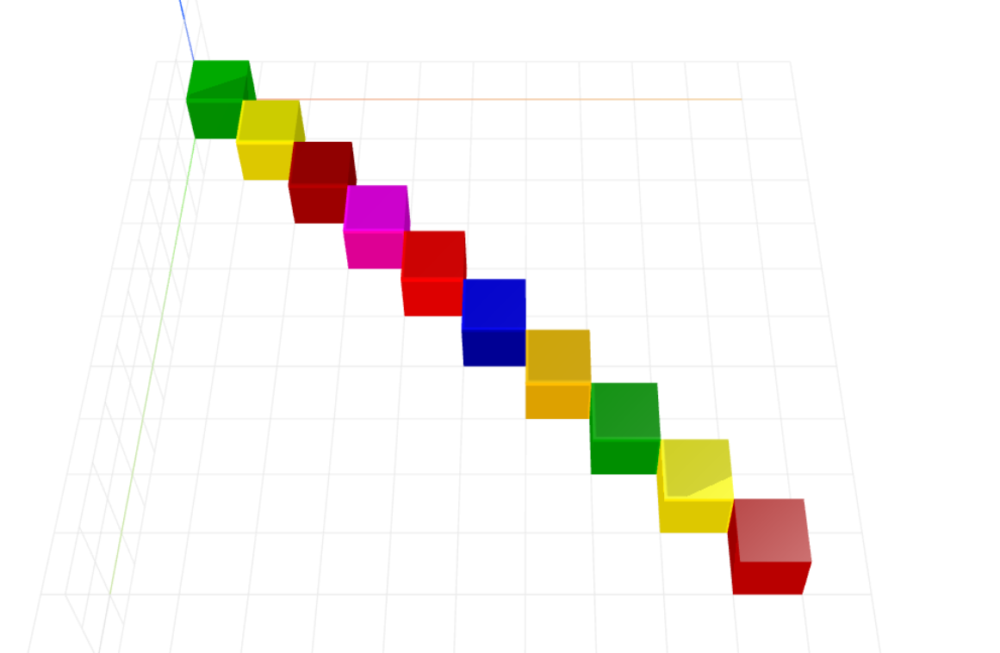

# diagonal-layout
Diagonal layout for CraftML

### Usage
```html
<craft>
    <craft name="diagonal-layout" module="diagonal-layout"/>
    <diagonal-layout></diagonal-layout>
</craft>
```

### Parameters
- spacing: adjusts spacing of item arrangement

### Example
```html
<craft>
    <craft name="diagonal-layout" module="diagonal-layout"/>
    
    <diagonal-layout>
        <repeat n="10">
            <cube></cube>
        </repeat>
    </diagonal-layout> 

</craft>
```

